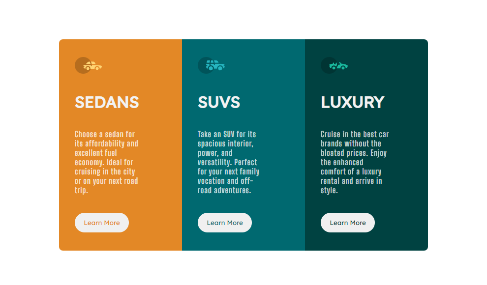

# Challenge Front-end Mentor
  <a href="https://klebson-antunes.github.io/3-column-preview-card-component/">Clique aqui e veja minha solução.</a>

 O desafio é criar esse componente de cartão de visualização de 3 colunas e deixá-lo o mais próximo possível do design:
       
 **Desktop design**:
 
 
 ### Minha Solução:
 Utilizei Flexbox e media queries, estado hover nos botões com efeito de remover o background e deixa o outline.

  

 